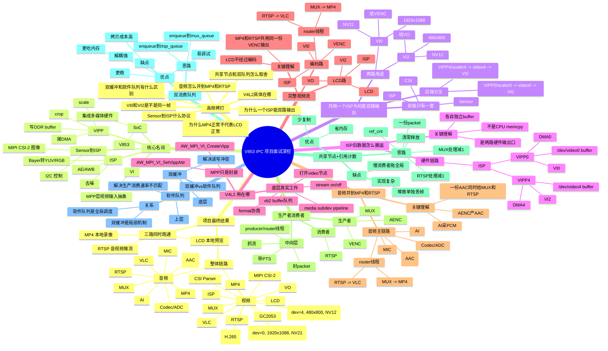

```mermaid
mindmap
  root((V853 IPC 项目面试深挖))
    项目最终结果
      三路同时跑通
        LCD 本地预览
        MP4 本地录像
        RTSP 音视频推流
      整体链路
        视频
          GC2053
          MIPI CSI-2
          CSI Parser
          ISP
          VI2(dev=4, 480x800, NV12)
          VO
          LCD
          VI0(dev=0, 1920x1088, NV21)
          VENC(H.265)
          MUX
          MP4
          RTSP
          VLC
        音频
          MIC
          Codec/ADC
          AI
          AENC(AAC)
          MUX
          MP4
          RTSP
          VLC
    核心名词
      SoC
        V853
        集成多媒体硬件
      Sensor到ISP
        I2C 控制
        MIPI CSI-2 图像
      ISP
        AE/AWB
        去噪
        Bayer转YUV/RGB
      VIPP
        crop
        scale
        接DMA
        写DDR buffer
      VI
        MPP层视频输入抽象
    共用一个ISP为何能双路输出
      前端只有一套
        Sensor
        CSI
        ISP
      后端分叉
        VIPP0/scaler0 -> video0 -> VI0
        VIPP4/scaler4 -> video4 -> VI2
      两路用途
        VI0
          1920x1088
          NV21
          给VENC
        VI2
          480x800
          NV12
          给VO
    ISP后数据怎么搬运
      硬件链路
        ISP
          VIPP0
            DMA0
            /dev/video0 buffer
            VI0
          VIPP4
            DMA4
            /dev/video4 buffer
            VI2
      关键理解
        不是CPU memcpy
        是两路硬件输出口
        各自独立buffer
    V4L2 用在哪
      MPP只是封装
        AW_MPI_VI_CreateVipp
        AW_MPI_VI_SetVippAttr
      底层真实工作
        打开video节点
        format协商
        media subdev pipeline
        vb2 buffer队列
        stream on/off
    完整视频流
      LCD路
        ISP
        VI2
        VO
        LCD
      编码路
        ISP
        VI0
        VENC
        router线程
          MUX -> MP4
          RTSP -> VLC
      关键理解
        LCD不经过编码
        MP4和RTSP共用同一份VENC输出
    音频并到MP4和RTSP
      音频主链路
        MIC
        Codec/ADC
        AI
        AENC(AAC)
        router线程
          MUX -> MP4
          RTSP -> VLC
      关键理解
        AI采PCM
        AENC产AAC
        一份AAC同时给MUX和RTSP
    生产者消费者
      生产者
        VENC
        AENC
      中间层
        producer/router线程
        抓流
        封packet
        带PTS
      消费者
        MUX
        RTSP
    共享节点+引用计数
      思路
        一份packet
        ref_cnt
        MUX处理减1
        RTSP处理减1
        清零释放
      优点
        省内存
        少复制
      缺点
        实现复杂
        慢消费者拖全局
        难做单独丢帧
    双消费队列
      思路
        enqueue到mux_queue
        enqueue到rtsp_queue
      优点
        解耦强
        更稳
        易调试
      缺点
        更吃内存
        拷贝成本高
    双缓冲vs软件队列
      双缓冲
        底层
        解决读写冲突
      软件队列
        上层
        解决生产消费速率不匹配
      关系
        双缓冲是局部机制
        软件队列是全局调度
    高频拷打
      Sensor到ISP什么协议
      为什么一个ISP能双路输出
      VI0和VI2是不是同一帧
      V4L2具体在哪
      为什么MP4正常不代表LCD正常
      音频怎么并到MP4和RTSP
      共享节点和双队列怎么取舍
      双缓冲和软件队列有什么区别
```
